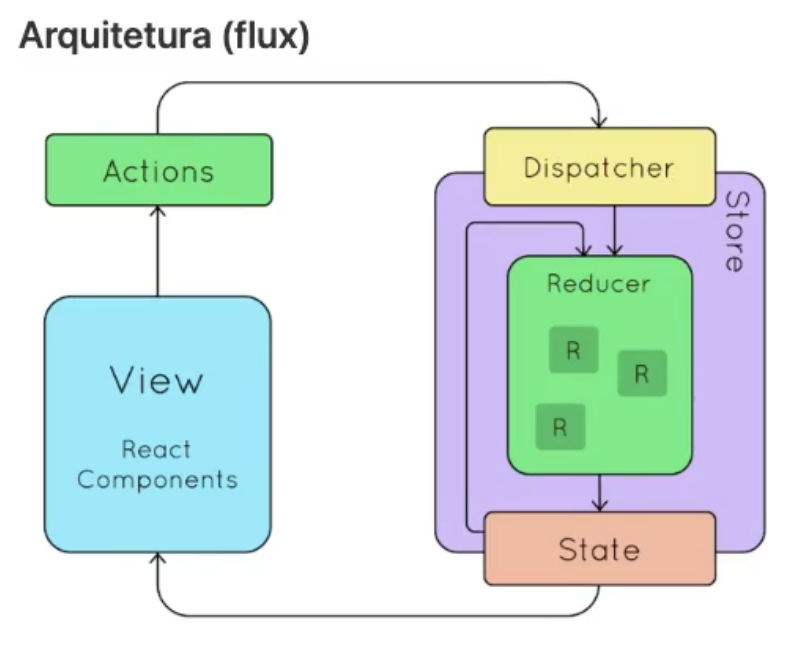

# React Redux Studies

## The Idea Behind Redux

Redux manages the **global state** of an application. Beyond each component's local state, there is a single global store accessible by all components.

### Historical Context

- **Pre-2017** — The Context API lacked features, making Redux the dominant choice for global state.
- **Today** — Context API is more capable, but Redux still offers things Context does not.

### Redux vs Context API

|                 | Redux                                 | Context API                            |
| --------------- | ------------------------------------- | -------------------------------------- |
| **Purpose**     | State management tool                 | A way to share data between components |
| **Key feature** | State history / time-travel debugging | Simple information sharing             |

> `useContext` + `useReducer` can approximate Redux behavior, but they are not the same.

---

## Types of State

| Type                    | Description                                               | Tools                                               |
| ----------------------- | --------------------------------------------------------- | --------------------------------------------------- |
| **Local state**         | Variable scoped to a single component (e.g. active tab)   | `useState`, `Context API`, Jotai, Recoil            |
| **Global state**        | Shared across the whole application (e.g. logged-in user) | Redux, `Context API` + `useReducer`, Zustand, Jotai |
| **Server / HTTP state** | Data fetched from a backend                               | React Query, SWR, Redux Toolkit                     |

---

## Core Concepts

### Event-Driven Architecture

1. A user interaction (e.g. button click) **dispatches an action**.
2. **Reducers** listen for dispatched actions and react accordingly.
3. Multiple reducers can listen to the same action.

### Key Primitives

- **Store** — holds the entire global state of the application.
- **Slice** — a logical segment of the store, typically scoped to a feature or domain (e.g. `auth`, `todo`).
